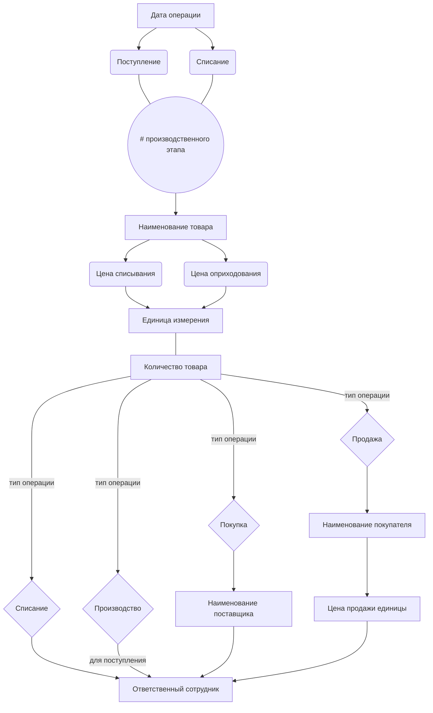

# Телеграм-бот для управленческого учета остатков на складе

Проект реализован через автоматизированную таблицу в Google Sheets, к которой бот подключается и с которой работает.

Сам бот реализуется через 4 файла: **main.py**, **sheet_handler.py**, **markups.py**, **globals.py**. Первый содержит главную логику Telegram-бота,
второй -- логику управления Google-таблицей, третий является сборником всех возможных кнопок (данный файл создает все
нужные кнопки сразу после запуска бота), четвертый -- вспомогательный файл с глобальными переменными.

После написания команды **/start** бот покажет вам главное меню, если он не занят другим пользователем. В главном меню представлены 7 кнопок: *просмотр общих остатков на складе* (общая сумма рублей остатков на складе), *текущие позиции на складе* (список находящихся на складе позиций), ***операции на складе*** (подробнее далее), *просмотреть произведенные товары* (просмотр всех произведенных на складе товаров; просмотр из чего произведен каждый товар), *отчет о прибыли*, *отчет о затратах*, и *кнопка обновления справочников*, если администратор изменил их в таблице.

# Операции на складе
Программа позволяет совершить операции 4-х видов: *покупку* (у какого-то субъекта), *продажу* (какому-то субъекту), *списание*, *отправку позиции в производство* (производственный этап).

При **покупке** вы по очереди заполняете такие поля как количество товара, цену покупки, субъекта-поставщика и т.д. Вам будут автоматически представлены кнопки из справочников, а также кнопка отмены на каждом из шагов. Бот будет автоматически проверять корректность ввода (например: невозможно ввести отрицательное количество товара). 

Похожая ситуация с операциями **продажи** и **списания**, но при этом бот также проверяет товар *на наличие* на складе в *достаточном* количестве.

Операция **производственного этапа** (отправки товара в производство) сначала будет запрашивать у вас  товары-материалы, которые вы собираетесь использовать для того, чтобы создать готовое изделие. Далее после нажатия кнопки подтверждения, вы заполняете данные непосредственно готового изделия. Кнопка отмены на всех шагах *полностью* отменяет данную операцию.

## Ограничения использования таблицы Google Sheets администратором

Одно из преимуществ связки Google Sheets и Telegram-бота заключается в гибкости подхода. Сама таблица также адаптирована для использования и изменения человеком. 

Все закрашенные ячейки редактировать **строго не рекомендуется**, поскольку они формульные и от них зависит работа как самой таблицы, так и бота. **Не следует добавлять новые столбцы**, если они не являются последними в таблице. Также строго следует **избегать редакции названий листов** таблицы, поскольку бот по ним ориентируется напрямую.

## Как смотреть на данные в таблице

**В верхней ячейке, закрашенной бледно-зеленым цветом** -- общая сумма остатков на текущий момент на складе в *рублях*.

**В блоке "Сумма"** -- общая сумма поступивших на склад или списанных с него рублей с данной операции.

**В блоке "Остаток на складе"** -- количество и сумма товара *на момент данной операции*. 
**В столбце "Склад"** -- индикаторы того, что данная операция *актуальна для склада* ["*На складе*"]. 

**Сумма продажи** -- общая сумма продажи для данной операции покупателю.
**Прибыль** -- вычисляется по следующей формуле: (цена продажи - расчетная цена списания) * списываемое количество

## Алгоритм использования таблицы администратором

 1. Записать **дату заведения операции** в соответствующий столбец.
 2. Записать является ли операция *фактическим* **списанием** или **поступлением** со склада/на склад.
 3. Записать **№ производственного этапа** (следующее натуральное число после максимального в данном столбце), если вы заводите операцию производственного этапа.
 4. Записать **наименование товара** (вам будет предоставлен выпадающий список, связанный со справочником).
 5. Записать **цену оприходования или списания**: если к вам на склад *поступает* товар -- то вы записываете, по какой цене он к вам поступил. Если вы *списываете* товар со склада, вам следует скопировать автоматически подсчитанное значение со следующего столбца (окрашенным желтым). *Чтобы желтый столбец все правильно подсчитал, важно, чтобы все последующие неформульные столбцы были пустыми!*
 6. Заполнить **единицу измерения**.
 7. Заполнить один из двух столбцов **количества товара**: при *поступлении* -- левый столбец, а при *списании* со знаком "-" правый.
 8. В следующем незакрашенном столбце указать **тип операции**: *покупку*, *продажу*, *списание*, *производство*.
 
     Далее:
     **При покупке**: указать в следующим за блоком продажи блоке **наименование поставщика**.
     **При продаже**: указать в следующем блоке **наименование покупателя** и **цену продажи** *единицы товара*.
 
 9. Указать **ответственного** за заполнение (или проведение) операции. *При заполнении операции производственного этапа, желательно указывать ответственного только для подоперации поступления на склад*.

